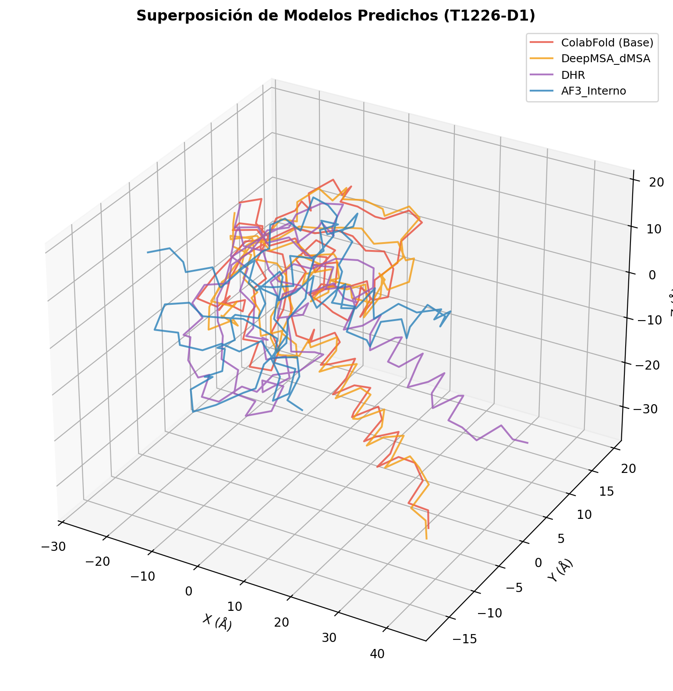
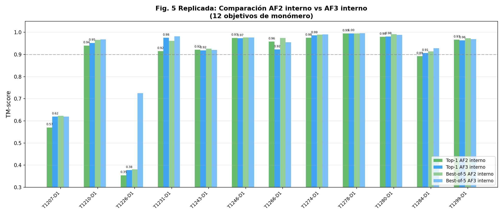
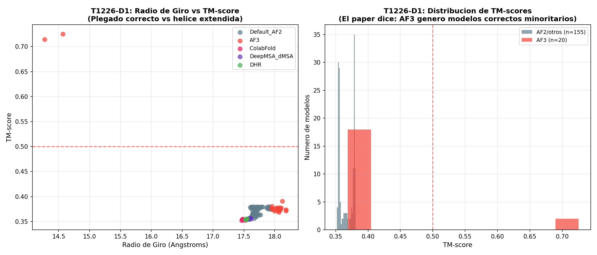
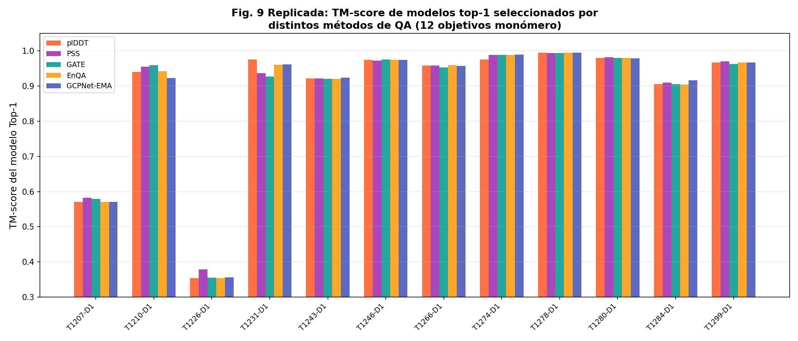
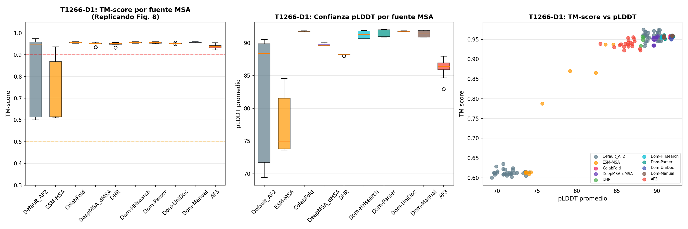

# Replica de Investigación - MULTICOM4 🧬

Bienvenido al repositorio de la réplica de investigación del sistema **MULTICOM4**, una aproximación avanzada para la predicción de estructuras de proteínas.

## 📌 Descripción del Proyecto

Este repositorio contiene todos los scripts, datos, cuadernos de Jupyter (Colab Notebooks), figuras generadas y documentos fuente (LaTeX) que corroboran la replicación de los resultados del *paper* original de **MULTICOM4** sobre la predicción de la estructura de proteínas (en el contexto de competiciones como CASP16).

El objetivo principal de este proyecto ha sido validar minuciosamente los resultados estructurales de proteínas descritos en la publicación original, recrear el entorno de experimentación, e iterar sobre los datos experimentales para generar los archivos PDF e imágenes con exactitud fidedigna.

<p align="center">
  <h3>Comparación de Modelos de Predicción 3D (T1226)</h3>
  
</p>

## 📊 Resultados Gráficos y Validaciones

A lo largo de la investigación, el repositorio genera gráficas analíticas como métricas GDT-TS, PTM y comparativas entre métodos. A continuación, ejemplos de los resultados obtenidos y alojados en la carpeta `verification_results/`:

| Comparación AF2 vs AF3 | Análisis Conformacional (T1226) |
| :---: | :---: |
|  |  |
| **Comparación de Métodos QA** | **Análisis de Dominios (T1266)** |
|  |  |

## 📂 Estructura del Repositorio

A continuación, una descripción general de los principales directorios y archivos:

- **`colab_notebooks/`**: Contiene los cuadernos de Google Colab (`.ipynb`) utilizados para las demostraciones de *AlphaFold2*, MSAs y otros análisis descritos en la investigación. También incluye el código fuente en formato LaTeX (`paper_profesional.tex`) para renderizar el paper con formato diario científico.
- **`zenodo/` y `test_data/`**: Contenían los datasets base, metadatos y subconjuntos de datos utilizados en la experimentación (GDT-TS, PTM, predicciones PDB).
- **`MULTICOM4/`**: Módulo base del sistema que integra los scripts del modelo.
- **Scripts de Python principales (`*.py`)**:
  - `replicate_paper_figures.py`, `generar_plots_fieles.py`: Scripts críticos utilizados para reconstruir las figuras y tablas del paper asegurando que los gráficos analíticos se correspondan exactamente con los publicacos.
  - `verify_thesis_complete.py`, `verify_structural_msa.py`: Utilidades que validan las estructuras generadas, cruzan metadatos y hacen análisis de QA (Quality Assurance) sobre los monómeros predecidos.
  - `run_data_analysis.py`: Ejecuta tareas generales de preparación de datos y análisis estadístico.
- **`s42003-025-08960-6_translated_spa.pdf`**: El artículo original sobre el cual se basa esta replicación, traducido/formateado.

> **Nota:** El archivo con los pesos completos o bases de datos masivas `dataset.tar.gz` (aprox. 210 MB) no ha sido incluido directamente en este repositorio debido a los límites predeterminados de tamaño por archivo de GitHub, pero sí el código completo necesario para el *pipeline*.

## ⚙️ Tecnologías y Lenguajes
* **Python 3.x** 
* **Pandas / Matplotlib / Seaborn** (Para análisis de datos y creación de figuras)
* **LaTeX** (Para la redacción del reporte científico profesional en formato de 2 columnas)
* **Jupyter / Google Colab** (Experimentación general)

## 🚀 Uso
Si deseas ejecutar los análisis tú mismo y replicar las figuras:

1. Clona este repositorio:
   ```bash
   git clone https://github.com/pumex1234/Replica-de-investigaci-n-.git
   ```
2. Asegúrate de instalar los requerimientos de Python.
3. Puedes ejecutar de forma individual los archivos `.py` para regenerar las visualizaciones correspondientes:
   ```bash
   python generar_plots_fieles.py
   python verify_thesis_complete.py
   ```

---
*Este proyecto fue desarrollado y analizado como etapa de verificación e investigación en la frontera del entendimiento bioinformático e IA en la predicción estructural de proteínas.*
